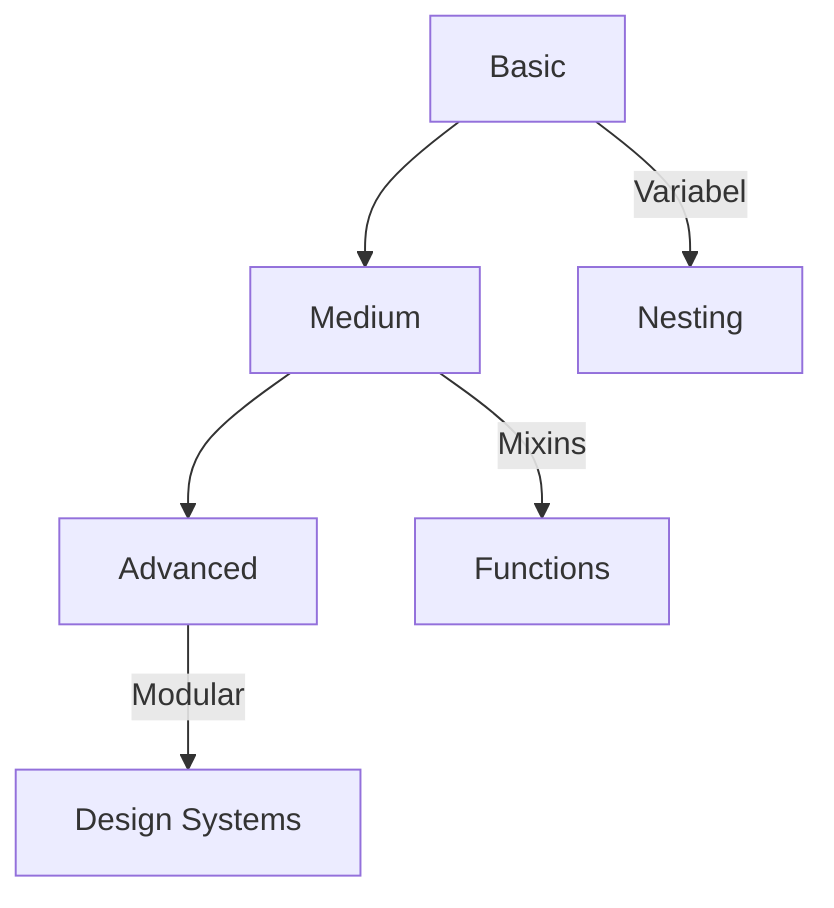

# 🎨 Struktur Proyek Sass: Dari Dasar hingga Expert


Repositori ini menyajikan struktur pembelajaran Sass terorganisir dalam 3 level: **Basic**, **Medium**, dan **Advanced**. Dirancang untuk membantu Anda menguasai Sass secara bertahap dengan contoh praktis!



## 📂 Struktur Folder

### 🧩 **Basic** - Konsep Dasar
```
basic/
├── 01-variables.scss       # Variabel dasar
├── 02-nesting.scss         # Teknik nesting
├── 03-parent-selector.scss # Parent selector (&)
├── 04-imports.scss         # Import file Sass
├── 05-comments.scss        # Sistem komentar
├── 06-basic-operations.scss # Operasi matematika
├── 07-basic-mixins.scss    # Pengenalan mixin
└── main.scss               # File utama
```

### ⚡ **Medium** - Level Menengah
```
medium/
├── 01-partials/            # Organisasi partials
│   ├── _variables.scss     # Variabel tingkat medium
│   ├── _reset.scss         # CSS reset
│   └── _typography.scss    # Gaya tipografi
├── 02-mixins.scss          # Mixin dengan parameter
├── 03-extend.scss          # Fitur extend/inheritance
├── 04-functions.scss       # Fungsi kustom
├── 05-if-else.scss         # Directive kontrol
└── main.scss               # File utama
```

### 🚀 **Advanced** - Level Expert
```
advanced/
├── 01-config/              # Konfigurasi advanced
│   ├── _colors.scss        # Sistem warna
│   ├── _breakpoints.scss   # Breakpoint responsive
│   └── _spacing.scss       # Sistem spacing
├── 02-utils/               # Utility classes
├── 03-components/          # Arsitektur komponen
└── main.scss               # File utama
```

## 🛠 Cara Menggunakan

### 🔧 Kompilasi Sass
```bash
# Install Sass global
npm install -g sass

# Kompilasi file basic
sass basic/main.scss basic/main.css

# Watch mode (auto compile saat perubahan)
sass --watch medium/main.scss:medium/main.css
```

### 📦 Dengan NPM Scripts
Tambahkan ke `package.json`:
```json
{
  "scripts": {
    "dev": "sass --watch src/scss:dist/css",
    "build": "sass src/scss:dist/css --style compressed"
  }
}
```

## 💡 Contoh Kode Menarik

### 🔥 Mixin Responsive
```scss
@mixin respond-to($breakpoint) {
  @if map-has-key($breakpoints, $breakpoint) {
    @media #{map-get($breakpoints, $breakpoint)} {
      @content;
    }
  }
}

// Penggunaan
.element {
  @include respond-to('medium') {
    color: red;
  }
}
```

### 🎨 Color Functions
```scss
@function tint($color, $percentage) {
  @return mix(white, $color, $percentage);
}

.button {
  background: tint(#3498db, 20%);
}
```

## 📊 Progres Pembelajaran

| Level | Konsep Utama | Waktu Belajar |
|-------|--------------|---------------|
| Basic | Variabel, Nesting | 2-3 jam |
| Medium | Mixins, Functions | 5-6 jam |
| Advanced | Arsitektur Modular | 10+ jam |

## 🚀 Kenapa Belajar Sass?

✅ **Organisasi Kode** Lebih terstruktur  
✅ **Fitur Powerful** Variabel, mixins, functions  
✅ **Maintainability** Mudah dikelola untuk proyek besar  
✅ **Kompatibilitas** Dikompilasi ke CSS standar  

---

<div align="center">
  <h3>🔥 Siap Menguasai Sass? Mulai Sekarang!</h3>
  
  
</div>
